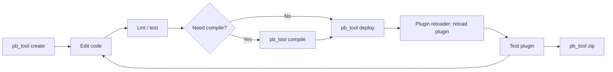

```mermaid
flowchart LR
    A[pb_tool create] --> B[Edit code]
    B --> C[Lint / test]
    C --> D{Need compile?}
    D -- Yes --> E[pb_tool compile]
    D -- No --> F[pb_tool deploy]
    E --> F[pb_tool deploy]
    F --> G[Plugin reloader: reload plugin]
    G --> H[Test plugin]
    H --> B
    H --> I[pb_tool zip]

```