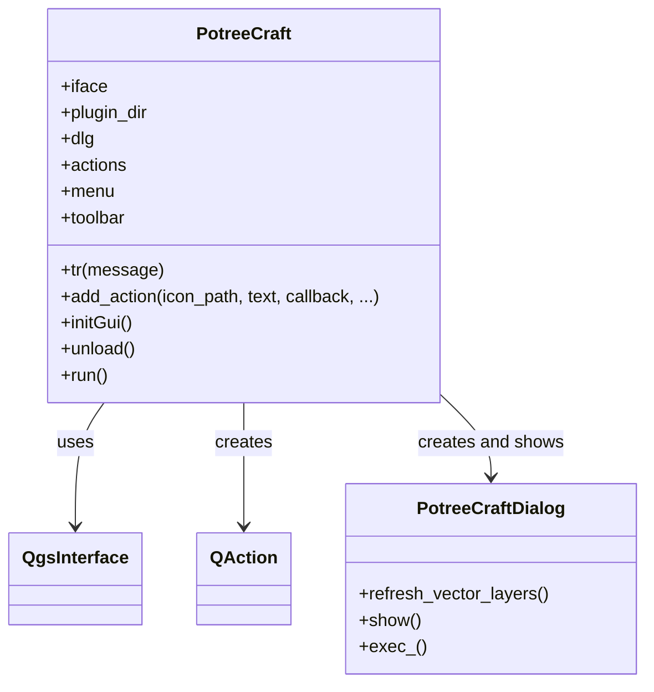
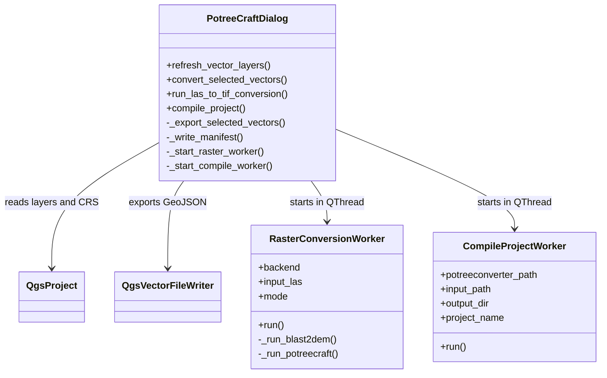
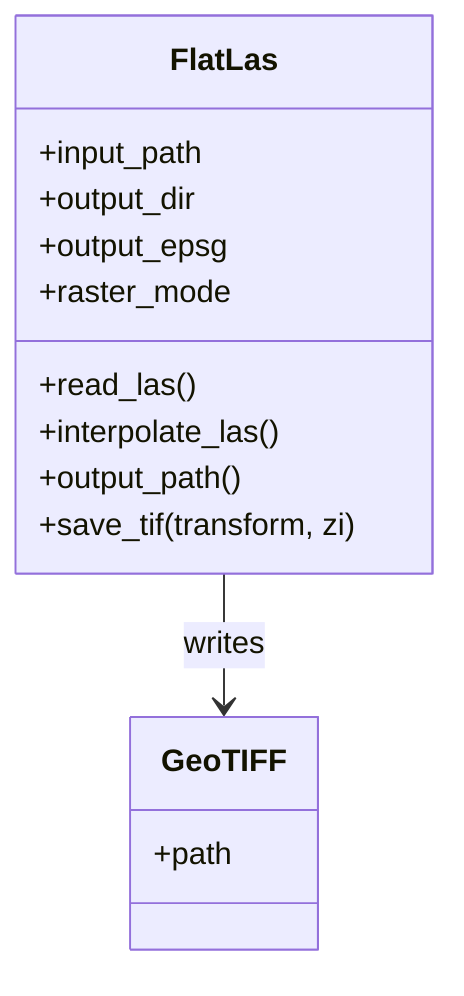

# PotreeCraft Plugin Chapter Notes

### 4.2.1 QGIS Plugin loader
The QGIS plugin loader is the entry mechanism that lets QGIS discover and instantiate PotreeCraft. In practice, QGIS reads the plugin package, evaluates its metadata, imports [`__init__.py`](/home/troll4hire/Documents/GitKraken/PotreeCraft/qgis_plugin/__init__.py), and calls `classFactory(iface)`. That factory function returns the main [`PotreeCraft`](/home/troll4hire/Documents/GitKraken/PotreeCraft/qgis_plugin/potreecraft.py) object, which then registers the toolbar button and menu entry used to open the user interface.

### 4.2.2 pb_tool.cfg
[`pb_tool.cfg`](/home/troll4hire/Documents/GitKraken/PotreeCraft/qgis_plugin/pb_tool.cfg) is the deployment configuration file used by `pb_tool`, a common helper for packaging QGIS plugins. In PotreeCraft it lists the Python source files, the main `.ui` file, the Qt resource collection, the plugin icon, metadata, license file, and the `jslibs` directory that must be copied into the distributable plugin bundle. This file is not part of runtime execution, but it is important in the build and release workflow because it defines what gets shipped.

### 4.2.3 metadata.txt
[`metadata.txt`](/home/troll4hire/Documents/GitKraken/PotreeCraft/qgis_plugin/metadata.txt) is the manifest that describes the plugin to QGIS. It contains the plugin name, version, supported QGIS range, author information, repository URLs, category, icon reference, and summary text shown inside the QGIS Plugin Manager. The file therefore acts as the public identity card of PotreeCraft and is required for installation and distribution.

### 4.2.4 __init__.py
[`__init__.py`](/home/troll4hire/Documents/GitKraken/PotreeCraft/qgis_plugin/__init__.py) is the Python entry point expected by QGIS. Its main responsibility is minimal by design: it exposes `classFactory(iface)`, imports the `PotreeCraft` class, and returns a plugin instance bound to the live `QgsInterface`. This separation keeps the bootstrap layer thin and delegates all application logic to the main plugin class.

### 4.2.5 potreecraft.py
[`potreecraft.py`](/home/troll4hire/Documents/GitKraken/PotreeCraft/qgis_plugin/potreecraft.py) contains the main plugin controller class. Its responsibility is to bridge QGIS and the PotreeCraft dialog by initializing translations, creating menu and toolbar actions, lazily instantiating the dialog, and handling plugin load and unload events. Architecturally, this module is the shell around the user interface: it does not perform conversion itself, but it controls when the dialog becomes available and how the plugin integrates into QGIS.

### 4.2.6 resources.py
[`resources.py`](/home/troll4hire/Documents/GitKraken/PotreeCraft/qgis_plugin/resources.py) is the auto-generated Python module produced by the Qt resource compiler. It embeds binary resource data and registers it with Qt so that assets can be referenced through resource paths such as `:/plugins/potreecraft/pc_icon_24.png`. Since it is generated code and contains no meaningful domain classes, a UML class diagram is not especially useful here.

### 4.2.7 resources.qrc
[`resources.qrc`](/home/troll4hire/Documents/GitKraken/PotreeCraft/qgis_plugin/resources.qrc) is the source resource collection file used by Qt. In the current plugin it declares the icon file under the `/plugins/potreecraft` prefix. During build time this XML file is compiled into [`resources.py`](/home/troll4hire/Documents/GitKraken/PotreeCraft/qgis_plugin/resources.py), which is then imported by the main plugin module.

### 4.2.8 plugin icon file
The plugin icon file, [`pc_icon_24.png`](/home/troll4hire/Documents/GitKraken/PotreeCraft/qgis_plugin/pc_icon_24.png), provides the visual identifier that appears in the QGIS toolbar, menu, and plugin manager. Even though it is only a small asset, it is operationally important because both [`metadata.txt`](/home/troll4hire/Documents/GitKraken/PotreeCraft/qgis_plugin/metadata.txt) and the Qt resource system refer to it. In other words, it is part of the plugin’s usability and discoverability rather than its business logic.

### 4.2.9 potreecraft_dialog.py
[`potreecraft_dialog.py`](/home/troll4hire/Documents/GitKraken/PotreeCraft/qgis_plugin/potreecraft_dialog.py) is the main application module of the plugin. It defines the dialog class shown to the user and also the worker classes responsible for long-running raster conversion and project compilation tasks. The module coordinates UI state, QGIS layer inspection, GeoJSON export, manifest writing, external tool invocation, and background-thread execution, so it serves as the orchestration layer of the whole plugin.

### 4.2.10 potreecraft_dialog_base.ui
[`potreecraft_dialog_base.ui`](/home/troll4hire/Documents/GitKraken/PotreeCraft/qgis_plugin/potreecraft_dialog_base.ui) is the Qt Designer form definition for the plugin window. It describes the static widget tree, including the vector-layer table, file path inputs, PotreeConverter controls, raster conversion controls, Cesium options, logging area, and action buttons. The `.ui` file therefore captures the structure of the interface, while [`potreecraft_dialog.py`](/home/troll4hire/Documents/GitKraken/PotreeCraft/qgis_plugin/potreecraft_dialog.py) supplies the interactive behavior.

### 4.2.11 potreecraft_core.py
[`potreecraft_core.py`](/home/troll4hire/Documents/GitKraken/PotreeCraft/qgis_plugin/potreecraft_core.py) contains the procedural backend for Potree project compilation. Its functions validate and normalize paths, execute `PotreeConverter`, copy the required runtime JavaScript libraries, synchronize exported GeoJSON files into the final output structure, resolve the generated point-cloud folder name, and finally call the HTML generator. Because the module is function-based rather than class-based, a UML class diagram is not particularly applicable; a flow or component diagram would describe it better than a class model.

### 4.2.12 potreecraft_lasreader.py
[`potreecraft_lasreader.py`](/home/troll4hire/Documents/GitKraken/PotreeCraft/qgis_plugin/potreecraft_lasreader.py) implements the built-in LAS or LAZ to GeoTIFF conversion backend. The central `FlatLas` class reads point-cloud coordinates and intensity values with `laspy`, interpolates them onto a regular raster grid using `numpy`, and writes the resulting GeoTIFF with `rasterio`. This module is especially important because it provides a portable internal alternative to the older external `blast2dem` workflow.

### 4.2.13 LAStools: blast2dem
`blast2dem` from LAStools is the legacy external rasterization backend supported by the dialog for compatibility reasons. When this mode is selected, PotreeCraft launches the executable as a subprocess and passes arguments that control the input file, output TIFF path, verbosity, and the selected raster display mode. This tool is useful where the external workflow is already established, but the current codebase clearly treats the built-in Python backend as the more integrated solution.

### 4.2.14 jslibs folder
The [`jslibs`](/home/troll4hire/Documents/GitKraken/PotreeCraft/qgis_plugin/jslibs) folder stores the client-side runtime libraries that PotreeCraft copies into generated projects. In the current repository this includes `Cesium183` and a project-specific `three.js` runtime tree. These files are not used inside QGIS itself; instead, they are deployed into the output web project so that `potree_main.html` can load the required JavaScript and CSS assets directly from the generated folder structure.

### 4.2.15 PotreeConverter
PotreeConverter is the main external processing dependency of the plugin. PotreeCraft does not replace it; instead, it wraps it in a more accessible QGIS-driven workflow. During compilation, the plugin calls the user-selected PotreeConverter executable, waits for the point-cloud web scene to be generated, then augments that output with vectors, runtime libraries, and a custom HTML front end. PotreeConverter can therefore be described as the foundation of the generated Potree scene, while PotreeCraft adds geospatial integration and presentation logic around it.

### 4.2.16 QGIS API
The QGIS API is the host platform interface used throughout the plugin. PotreeCraft depends on `QgsInterface` for UI integration, `QgsProject` for reading the active project state and CRS, `QgsVectorFileWriter` for GeoJSON export, `QgsMessageLog` for logging, and several PyQt classes for widgets, signals, threads, and dialogs. Without these APIs the plugin would lose both its GIS context and its native integration into the QGIS desktop environment.

### 4.2.17 project output folder
The project output folder is the generated web project root selected by the user in the dialog. Based on the implementation in [`potreecraft_dialog.py`](/home/troll4hire/Documents/GitKraken/PotreeCraft/qgis_plugin/potreecraft_dialog.py), [`potreecraft_core.py`](/home/troll4hire/Documents/GitKraken/PotreeCraft/qgis_plugin/potreecraft_core.py), and [`potreecraft_geojson_reader.py`](/home/troll4hire/Documents/GitKraken/PotreeCraft/qgis_plugin/potreecraft_geojson_reader.py), this directory typically contains the PotreeConverter output, a `libs/` directory with copied runtime assets, a `vectors/` directory with exported GeoJSON files, the generated `potree_main.html`, and the `potreecraft_project_manifest.json` metadata file. It acts as the handoff point between desktop authoring in QGIS and browser-based visualization.

### 4.2.18 http server
The HTTP server is not part of the plugin codebase itself, but it is a practical requirement for viewing the generated Potree project correctly in a browser. The project README recommends serving the output directory either with Python’s built-in `http.server` module or with the `http-server` npm package. This chapter is relevant because many of the generated runtime assets, JavaScript modules, and browser requests work more reliably over a local web server than by opening the HTML file directly from the filesystem.
