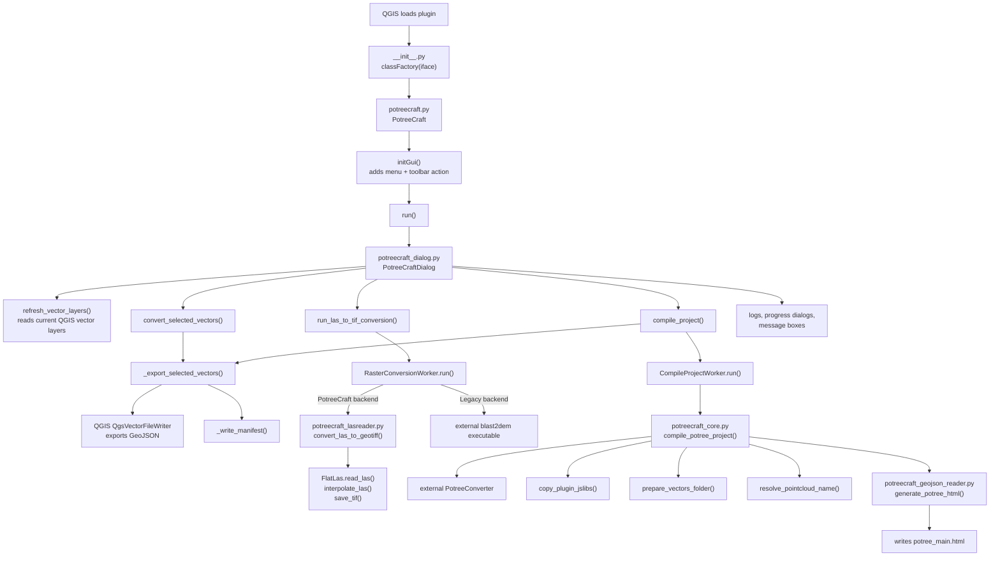

# PotreeCraft Plugin Relations: Full Call Flow

```mermaid
flowchart TD
    QGIS[QGIS loads plugin] --> INIT["__init__.py<br/>classFactory(iface)"]
    INIT --> PLUGIN["potreecraft.py<br/>PotreeCraft"]

    PLUGIN --> GUI["initGui()<br/>adds menu + toolbar action"]
    GUI --> RUN["run()"]
    RUN --> DIALOG["potreecraft_dialog.py<br/>PotreeCraftDialog"]

    DIALOG --> REFRESH["refresh_vector_layers()<br/>reads current QGIS vector layers"]

    DIALOG --> EXPORT["convert_selected_vectors()"]
    EXPORT --> EXPORT2["_export_selected_vectors()"]
    EXPORT2 --> QGISWRITE["QGIS QgsVectorFileWriter<br/>exports GeoJSON"]
    EXPORT2 --> MANIFEST["_write_manifest()"]

    DIALOG --> RASTER["run_las_to_tif_conversion()"]
    RASTER --> RWORKER["RasterConversionWorker.run()"]
    RWORKER -->|PotreeCraft backend| LAS["potreecraft_lasreader.py<br/>convert_las_to_geotiff()"]
    LAS --> FLATLAS["FlatLas.read_las()<br/>interpolate_las()<br/>save_tif()"]
    RWORKER -->|Legacy backend| BLAST["external blast2dem executable"]

    DIALOG --> COMPILE["compile_project()"]
    COMPILE --> EXPORT2
    COMPILE --> CWORKER["CompileProjectWorker.run()"]
    CWORKER --> CORE["potreecraft_core.py<br/>compile_potree_project()"]
    CORE --> CONVERTER["external PotreeConverter"]
    CORE --> COPYLIBS["copy_plugin_jslibs()"]
    CORE --> PREPVEC["prepare_vectors_folder()"]
    CORE --> RESOLVE["resolve_pointcloud_name()"]
    CORE --> GEO["potreecraft_geojson_reader.py<br/>generate_potree_html()"]
    GEO --> HTML["writes potree_main.html"]

    DIALOG --> UI["logs, progress dialogs,<br/>message boxes"]
```
