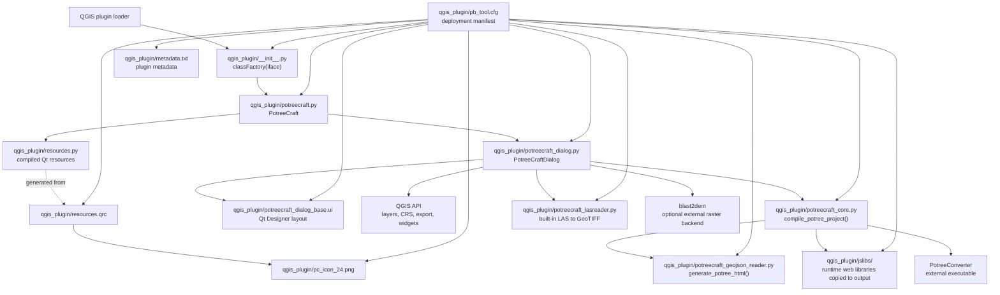

# PotreeCraft Plugin Surface Relations

This is a surface-level file interaction map for the QGIS plugin package in `qgis_plugin/`.

## Quick reading notes

- `__init__.py` is the QGIS entry point and hands control to `potreecraft.py`.
- `potreecraft.py` wires the toolbar/menu action and opens `potreecraft_dialog.py`.
- `potreecraft_dialog.py` is the main coordinator. It talks to QGIS, launches vector export, starts project compilation through `potreecraft_core.py`, and can run raster generation through `potreecraft_lasreader.py` or external `blast2dem`.
- `potreecraft_core.py` is the build pipeline. It runs external `PotreeConverter`, copies `jslibs/`, and calls `potreecraft_geojson_reader.py` to produce the final Potree HTML.
- `resources.py` is not edited by hand in normal workflow; it is the compiled Python form of `resources.qrc`, which includes the plugin icon path used by `potreecraft.py`.
- `pb_tool.cfg` is the packaging/deployment map. It declares which plugin files are shipped together, so it is important even though it is not part of runtime execution.
天天中彩票♀♀♀♀♀♀assistant to=multi_tool_use.parallel კომენტary  天天中彩票大奖json
